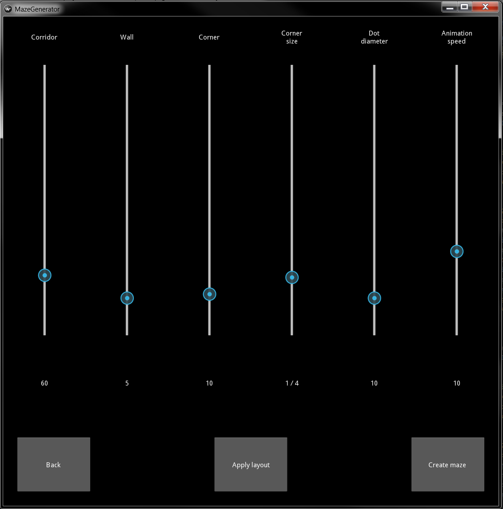
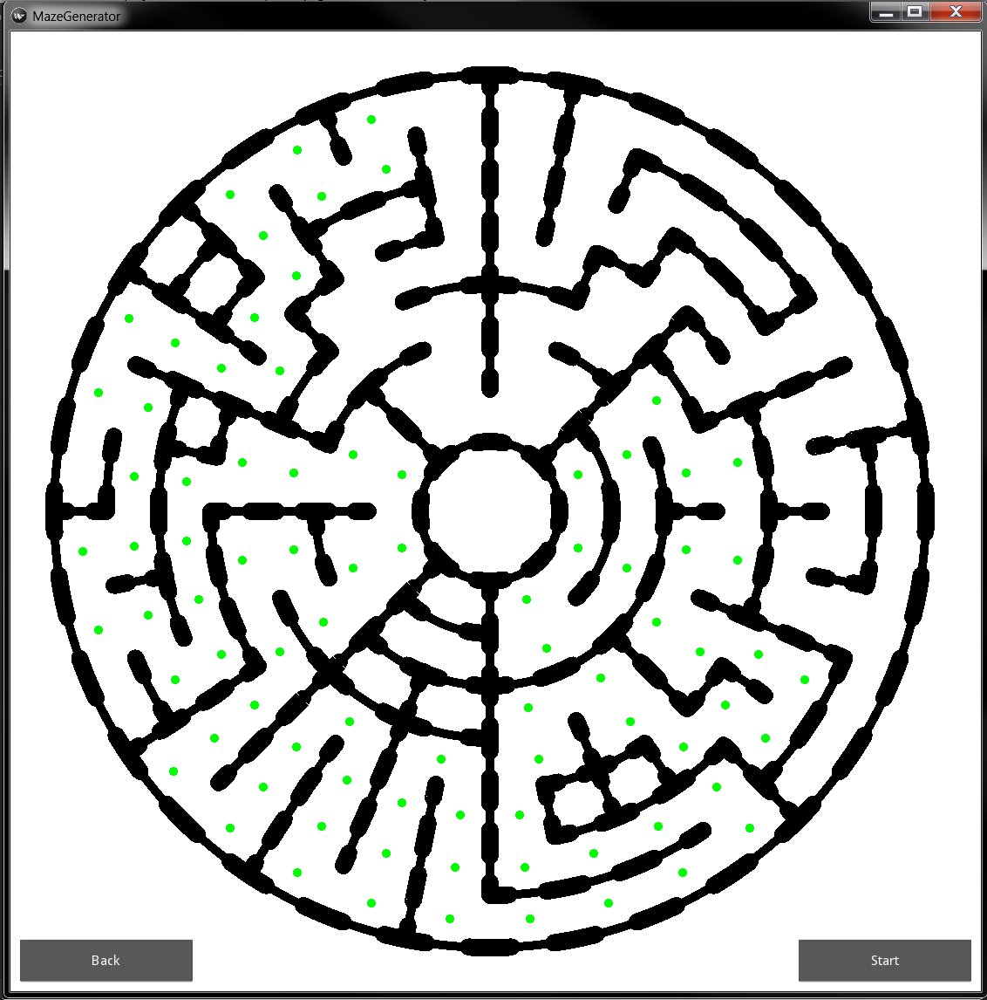

Circular Maze Generator
=======================

First ever built python program just for fun. Going nuts with my raspberry pi I got the taste for coding.
Build with python 2.7 and kivy 1.9

Maze Settings
-------------

There are characteristics of the maze that can be set.

* Corridor width - Determines the width of the corridors and as a result the number of rings

* Wall thickness in pixels.

* Corner thickness in pixels.

* Corner size as a part of wedge width.

* Dot diameter for walker dot.

* Animation speed

It is possible to change these settings (except for the corridor width) with an already generated maze. If you got a maze you like you can go back and change the layout.

Footnote
--------

| **I want to be a developer!**
|
| Got a job? Like what you see?
| Send me a message, I would love to hear your proposition.

Enjoy your stay on my repository and happy codings!!
